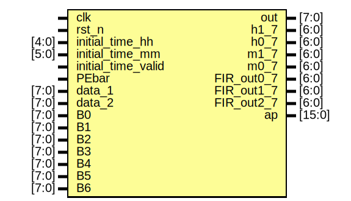
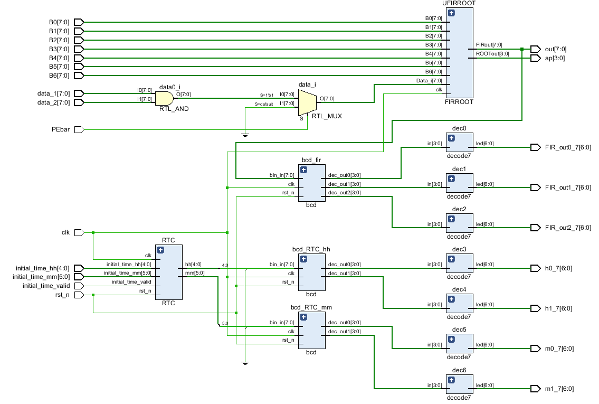

# What's this
- A 8bit fir design in pipeline
- A 8bit sqrt 
- A single cycle BCD decoder
- A strange 3-7 lcd decoder
- A RTC
- Put them all together

# Entity: top
## Diagram

## Description

已完成：

1. 时钟所有功能
2. 数据的与
3. 十进制转BCD（理论上最大999，溢出标志还没做）
4. 七段译码

## Generics and ports
### Table 1.1 Generics
### Table 1.2 Ports

| Port name          | Direction | Type   | Description                                 |
| ------------------ | --------- | ------ | ------------------------------------------- |
| clk                | input     |        |                                             |
| rst_n              | input     |        |                                             |
| initial_time_hh    | input     | [4:0]  |                                             |
| initial_time_mm    | input     | [5:0]  |                                             |
| initial_time_valid | input     |        |                                             |
| PEbar              | input     |        | PEbar置1期间，data有效                      |
| data_1             | input     | [7:0]  |                                             |
| data_2             | input     | [7:0]  |                                             |
| B0                 | input     | [7:0]  |                                             |
| B1                 | input     | [7:0]  |                                             |
| B2                 | input     | [7:0]  |                                             |
| B3                 | input     | [7:0]  |                                             |
| B4                 | input     | [7:0]  |                                             |
| B5                 | input     | [7:0]  |                                             |
| B6                 | input     | [7:0]  |                                             |
| out                | output    | [7:0]  |                                             |
| h1_7               | output    | [6:0]  | **_7** 均为2进制转BCD并进行七段译码后的结果 |
| h0_7               | output    | [6:0]  |                                             |
| m1_7               | output    | [6:0]  |                                             |
| m0_7               | output    | [6:0]  |                                             |
| FIR_out0_7         | output    | [6:0]  |                                             |
| FIR_out1_7         | output    | [6:0]  |                                             |
| FIR_out2_7         | output    | [6:0]  |                                             |
| ap                 | output    | [15:0] | 对out开方后的结果，在4-16译码与out同步输出  |

## Schematic

## To Do
- [ ] 如何优雅的验证七段数码管功能的正确性？

