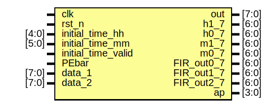

# Entity: top
## Diagram

## Description

已完成：

1. 时钟所有功能
2. 数据的与
3. 十进制转BCD（理论上最大999，溢出标志还没做）
4. 七段译码

## Generics and ports
### Table 1.1 Generics
### Table 1.2 Ports
| Port name          | Direction | Type  | Description                  |
| ------------------ | --------- | ----- | ---------------------------- |
| clk                | input     |       |                              |
| rst_n              | input     |       |                              |
| initial_time_hh    | input     | [4:0] |                              |
| initial_time_mm    | input     | [5:0] |                              |
| initial_time_valid | input     |       | 更新时钟，持续不超过一个周期 |
| PEbar              | input     |       | 数据有效，持续不超过一个周期 |
| data_1             | input     | [7:0] |                              |
| data_2             | input     | [7:0] |                              |
| out                | output    | [7:0] |                              |
| h1_7               | output    | [6:0] | _7均为经过七段译码后的数据   |
| h0_7               | output    | [6:0] |                              |
| m1_7               | output    | [6:0] |                              |
| m0_7               | output    | [6:0] |                              |
| FIR_out0_7         | output    | [6:0] |                              |
| FIR_out1_7         | output    | [6:0] |                              |
| FIR_out2_7         | output    | [6:0] |                              |
| ap                 | output    | [3:0] | \sqrt{x}                     |
## Schematic

## To Do
- [ ] 把滤波和开平方放在同一个模块里，替代fir.v（目前这个模块就是个简单打拍子然后加数，象征处理过程）

- [ ] 现在是直接把端口的数往外面发，具体的数据同步发送等功能最后再往上加吧

